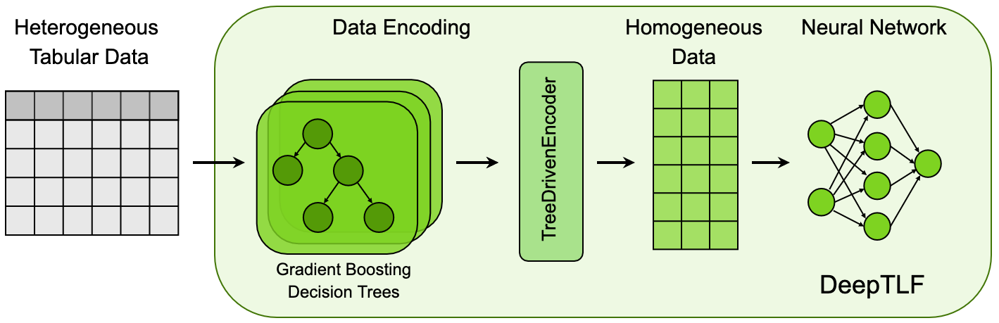

# DeepTLF: A Framework for Enhanced Deep Learning on Tabular Data



## Overview

**DeepTLF** significantly outperforms traditional Deep Neural Networks (DNNs) in handling tabular data. Using our novel TreeDrivenEncoder, we transform complex, heterogeneous data into a format highly compatible with DNNs. This enables a 19.6% average performance increase compared to conventional DNNs.

## Installation

You can install DeepTLF directly from PyPI:

```bash
pip install deeptlf
```

## Quick Start

Seamlessly integrate DeepTLF into your workflow through its scikit-learn-compatible API:

```python
from deeptlf import DeepTFL

# Initialize and train model
dtlf_model = DeepTFL(n_est=23, max_depth=3, drop=0.23, n_layers=4, task='class')
dtlf_model.fit(X_train, y_train)

# Make predictions
dtlf_y_hat = dtlf_model.predict(X_test)
```

## Features
- Transforms heterogeneous data into DNN-friendly format
- Supports multimodal learning
- Adheres to the scikit-learn API for effortless integration
- Features advanced options like custom layers, dropout rates, and more


## Citation
To cite DeepTLF in your work:
```bib
@article{borisov2022deeptlf,
  title={DeepTLF: robust deep neural networks for heterogeneous tabular data},
  author={Borisov, Vadim and Broelemann, Klaus and Kasneci, Enkelejda and Kasneci, Gjergji},
  journal={International Journal of Data Science and Analytics},
  pages={1--16},
  year={2022},
  publisher={Springer}
}
